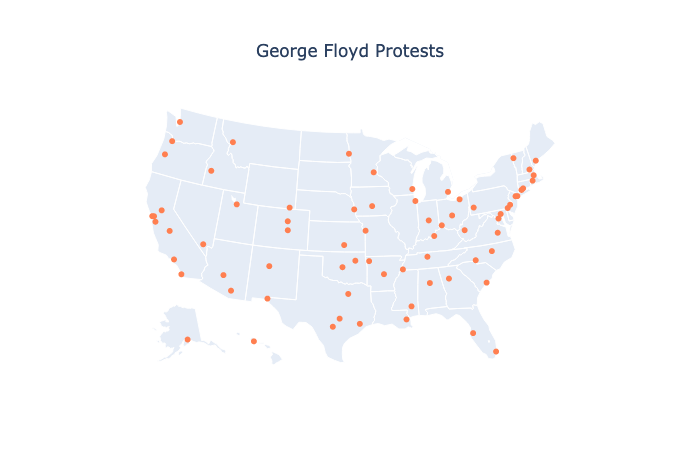

# GeorgeFloydProtests
This is a repository to store graphs related to George Floyd Protests in the United States in May/June 2020.

The first graph is below: 

Note that all 50 U.S. states are represented, as well as 49 of the top 50 most populous cities in the United States.

For an interactive map, with labels, see protest_cities.html.
